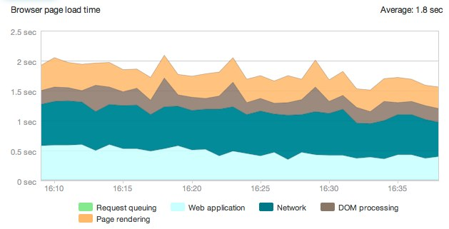
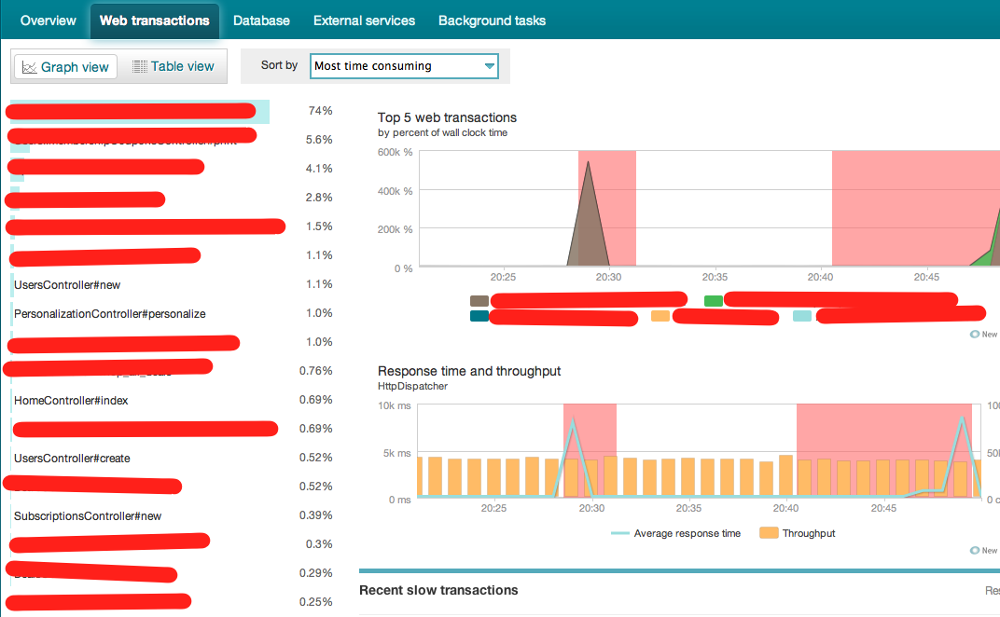
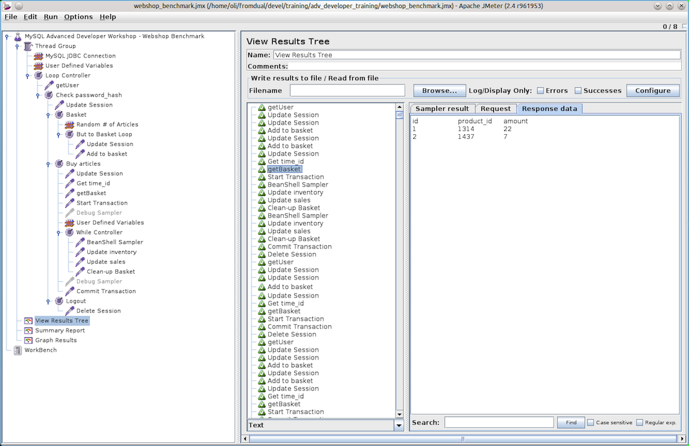

!SLIDE
# Part 1 #
## Know Your App ##

!SLIDE bullets

# Understand it #
* New Relic
* Scout
* ruby-prof
* rails g performance_test yo

!SLIDE center

!SLIDE center

!SLIDE bullets

# Profile Your App #
* AB is not that great.
* Use a real tool like Apache JMeter.

!SLIDE center

!SLIDE 
# Huge learning curve, but very worth it #

!SLIDE bullets small
* test plans and threads
* per worker (thread) cookies
* dynamic data
* conditions
* monitor servers, mysql, etc...
* plugins galore
* full of awesome

!SLIDE bullets

# Find weakness #

!SLIDE bullets

* Not caches\_page’ing, caches\_action’ing, and fragment caching eveything & anything
* External Everything (api calls, etc..)
* .each without using :include 

!SLIDE bullets
* ###_Shitty SQL_###

!SLIDE bullets center

* ActionMailering, Reporting, Processing inside an action
* Move to the background yo

!SLIDE bullets small

# Resque to the Resue #

!SLIDE bullets
* emailing users
* rmagicking
* tarballing
* reporting
* gather external
* mass deleting, adding, updating, altering
* _anything_ that would otherwise chew up a worker

!SLIDE bullets incremental
# to summarize #

* gain an insight into where you app spends time on each request
* and make it spend less